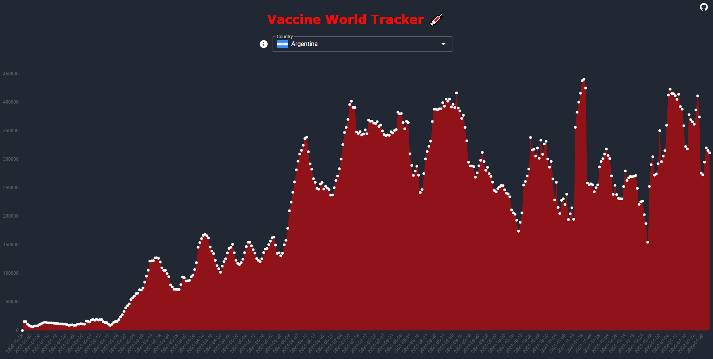
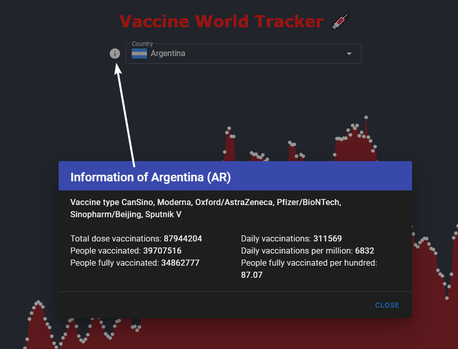

<h1 align="center">Vaccine World Tracker</h1>

</img>

# TRY IT 🚀
[Website](https://vaccine-world-tracker.netlify.app/)

# Description
Graph showing information about the progress of vaccination in the world.
Vaccine types, total dose vaccinations, people partially and fully vaccinated, daily stats.

</img>

